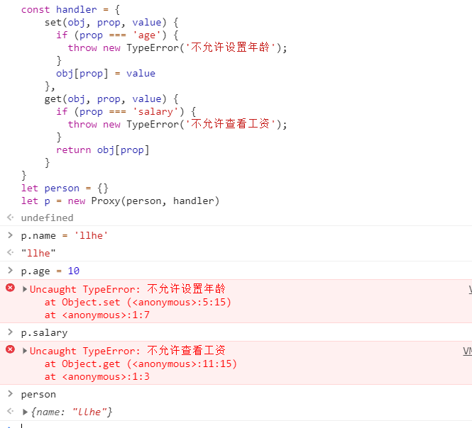
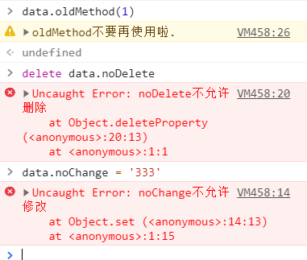

Proxy 对象用于定义基本操作的自定义行为（如属性查找、赋值、枚举、函数调用等）。
>Proxy，其功能非常类似于设计模式中的代理模式，该模式常用于三个方面：  
拦截和监视外部对对象的访问  
降低函数或类的复杂度  
在复杂操作前对操作进行校验或对所需资源进行管理  

### 语法
```js
// handler: 通常以函数作为属性的对象，各属性中的函数分别定义了在执行各种操作时代理 p 的行为。
// target: 要使用 Proxy 包装的目标对象（可以是任何类型的对象，包括原生数组，函数，甚至另一个代理）。
const p = new Proxy(target, handler)
```

### 方法
* Proxy.revocable() 创建一个可撤销的Proxy对象。

### 使用说明
```js
const handler = {
    set(obj, prop, value) {
      if (prop === 'age') {
        throw new TypeError('不允许设置年龄');
      }
      obj[prop] = value
    },
    get(obj, prop, value) {
      if (prop === 'salary') {
        throw new TypeError('不允许查看工资');
      }
      return obj[prop]
    }
}
let person = {}
let p = new Proxy(person, handler)
```
  
可以看出Proxy对象的作用： 重新定义基本操作的行为。

### Proxy所能代理的范围 --- handler
以上代码中，为什么handler中设置了set和get能拦截掉对象本身默认的行为呢。    
实际上handler是ES6新设计的一个对象，用于`自定义对象的各种可代理操作`。它本身一共有13中方法,每种方法都可以代理一种操作.    
其13种方法如下:
```js
// 在读取代理对象的原型时触发该操作，比如在执行 Object.getPrototypeOf(proxy) 时。
handler.getPrototypeOf()

// 在设置代理对象的原型时触发该操作，比如在执行 Object.setPrototypeOf(proxy, null) 时。
handler.setPrototypeOf()

// 在判断一个代理对象是否是可扩展时触发该操作，比如在执行 Object.isExtensible(proxy) 时。
handler.isExtensible()

// 在让一个代理对象不可扩展时触发该操作，比如在执行 Object.preventExtensions(proxy) 时。
handler.preventExtensions()

// 在获取代理对象某个属性的属性描述时触发该操作，比如在执行 Object.getOwnPropertyDescriptor(proxy, "foo") 时。
handler.getOwnPropertyDescriptor()

// 在定义代理对象某个属性时的属性描述时触发该操作，比如在执行 Object.defineProperty(proxy, "foo", {}) 时。
handler.defineProperty()

// 在判断代理对象是否拥有某个属性时触发该操作，比如在执行 "foo" in proxy 时。
handler.has()

// 在读取代理对象的某个属性时触发该操作，比如在执行 proxy.foo 时。
handler.get()

// 在给代理对象的某个属性赋值时触发该操作，比如在执行 proxy.foo = 1 时。
handler.set()

// 在删除代理对象的某个属性时触发该操作，比如在执行 delete proxy.foo 时。
handler.deleteProperty()

// 在获取代理对象的所有属性键时触发该操作，比如在执行 Object.getOwnPropertyNames(proxy) 时。
handler.ownKeys()

// 在调用一个目标对象为函数的代理对象时触发该操作，比如在执行 proxy() 时。
handler.apply()

// 在给一个目标对象为构造函数的代理对象构造实例时触发该操作，比如在执行new proxy() 时。
handler.construct()
```

### 使用场景
* 抽离校验模块
```js
let person = {
    name: 'llhe',
    age: 14,
    salary: 100000
}
person = new Proxy(person, {
    set(target, key, value, proxy) {
      if (key === 'age' && typeof value !== 'number') {
        throw Error('年龄只能设置数字')
      }
      return Reflect.set(target, key, value, proxy)
    }
})
// 测试
person.age = '22'
// Uncaught Error: 年龄只能设置数字
```

* 私有属性
在 JavaScript 或其他语言中，大家会约定俗成地在变量名之前添加下划线 _ 来表明这是一个私有属性（并不是真正的私有），但我们无法保证真的没人会去访问或修改它。使用Proxy可以实现私有变量。[当然啦，class中已经可以定义private了]     
可以使用has拦截,也可以像第一个demo那样使用get set拦截
```js
let app = {
  name: '系统',
  _appsercet: 'XXXX',
  _appKey: 'YYY'
}
const limit = ['_appsercet', '_appKey']
app = new Proxy(app, {
    has(target, key) {
      return limit.indexOf(key) > -1 ? false : Reflect.has(target, key)
    }
})
// 测试
'_appKey' in app // false
'name' in app // true
```

* 预警和拦截
如果你不想其他开发者删除noDelete属性，不想其他开发者修改noChange属性，不想让其他开发者调用oldMethod,可以这样做：
```js
let data = {
  noDelete: 1234,
  oldMethod: function() {},
  noChange: '4783'
}
// 这是种很好的写法，把有含义的变量定义起来
const NODELETE = ['noDelete']
const NOCHANGE = ['noChange']
const OLDMETHOD = ['oldMethod']
data = new Proxy(data, {
    set(target, key, value, proxy) {
      if (NOCHANGE.includes(key)) {
        throw Error(`${key}不允许修改`)
      }
      return Reflect.set(target, key, value, proxy)
    },
    deleteProperty(target, key) {
      if (NODELETE.includes(key)) {
        throw Error(`${key}不允许删除`)
      }
      return Reflect.deleteProperty(target, key)
    },
    get(target, key, value, proxy) {
      if (OLDMETHOD.includes(key)) {
        console.warn(`${key}不要再使用啦.`);
      }
      const val = target[key]
      return typeof val === 'function' ? function(...args) { Reflect.apply(target[key], target, args); } : val
    }
})
```


* 过滤操作
* 中断代理

### Decorator
ES7中实现的Decorator，相当于设计模式中的装饰器模式。如何简单地区分Decorator与Proxy,可以概括为：Proxy 的核心作用是控制外界对被代理者内部的访问，Decorator 的核心作用是增强被装饰者的功能

### 一些想法
看到proxy的拦截功能，突然好奇element的表单校验是怎么实现的。
看了源码，没有使用到Proxy,就是调用rules中的验证方法。

### 参考链接
[MDN文档](https://developer.mozilla.org/zh-CN/docs/Web/JavaScript/Reference/Global_Objects/Proxy)     
[掘金](https://juejin.im/post/5a5227ce6fb9a01c927e85c4)    
[大漠的博客](https://www.w3cplus.com/javascript/use-cases-for-es6-proxies.html)  
[对象描述符](https://developer.mozilla.org/zh-CN/docs/Web/JavaScript/Reference/Global_Objects/Object/defineProperty)