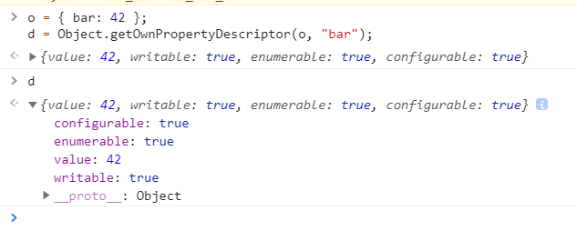

### 描述
Reflect 是一个内置的对象，它提供拦截 JavaScript 操作的方法。这些方法与proxy handlers的方法相同。Reflect不是一个函数对象，因此它是不可构造的。[不能通过new构造实例]    
Reflect的所有属性和方法都是静态的（就像Math对象）。     

### 静态方法
1. `Reflect.apply(target, thisArgument, argumentsList)`    
对一个函数进行调用操作，同时可以传入一个数组组为调用参数。和 Function.prototype.apply() 功能类似。

2. `Reflect.construct(target, argumentsList[, newTarget])`    
对构造函数进行 new 操作，相当于执行 new target(...args)。

3. `Reflect.defineProperty(target, propertyKey, attributes)`      
和 Object.defineProperty() 类似。如果设置成功就会返回 true

4. `Reflect.deleteProperty(target, propertyKey)`
作为函数的delete操作符，相当于执行 delete target[name]。

5. `Reflect.get(target, propertyKey[, receiver])`   
获取对象身上某个属性的值，类似于 target[name]。

6. `Reflect.getOwnPropertyDescriptor(target, propertyKey)`    
类似于 Object.getOwnPropertyDescriptor()。返回对象属性对应的属性描述符，没有则返回undefined


7. `Reflect.getPrototypeOf(target)`   
返回指定对象的原型。类似于 Object.getPrototypeOf()。    

8. `Reflect.has(target, propertyKey)`   
判断一个对象是否存在某个属性，和 in 运算符 的功能完全相同。

9. `Reflect.isExtensible(target)`   
判断一个对象是否是可扩展的（是否可以在它上面添加新的属性）。类似于 Object.isExtensible().

10. `Reflect.ownKeys(target)`   
返回一个包含所有自身属性（不包含继承属性）的数组。(类似于 Object.keys(), 但不会受enumerable影响).

11.  `Reflect.preventExtensions(target)`    
让一个对象变的不可扩展，也就是永远不能再添加新的属性。类似于 Object.preventExtensions()。返回一个Boolean。

12. `Reflect.set(target, propertyKey, value[, receiver])`   
将值分配给属性的函数。返回一个Boolean，如果更新成功，则返回true。

13. `Reflect.setPrototypeOf(target, prototype)`     
设置对象原型的函数. 返回一个 Boolean， 如果更新成功，则返回true。

### 使用
1. 检测一个对象是否有某个属性
```js
const duck = {
    name: 'Maurice',
    color: 'white',
    greeting: function() {
      console.log(`Quaaaack! My name is ${this.name}`);
    }
}
Reflect.has(duck, 'color');
// true
Reflect.has(duck, 'haircut');
// false
```