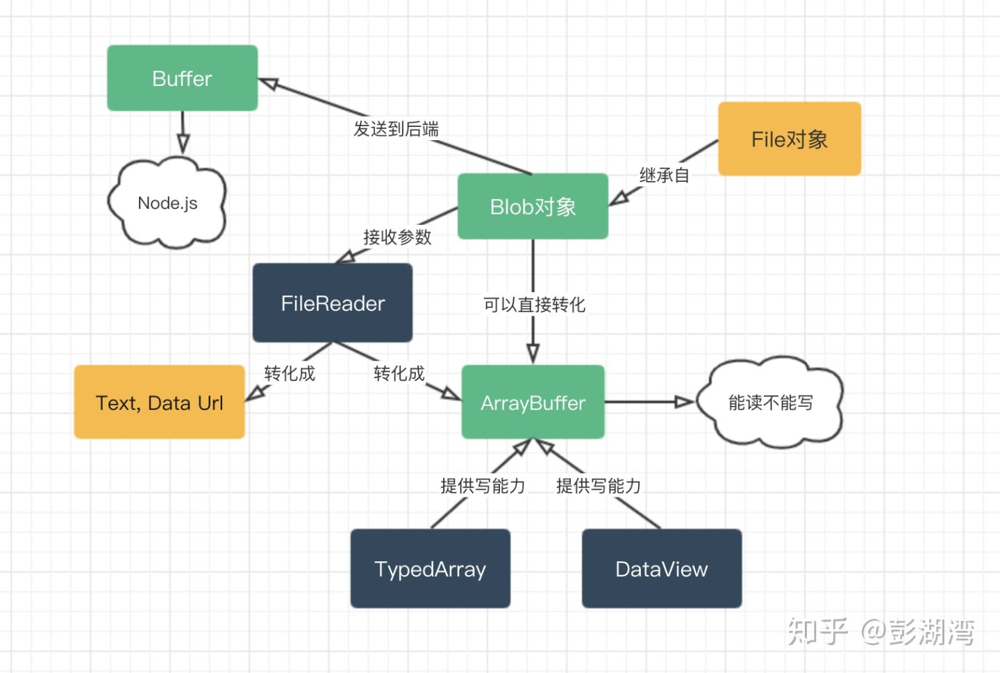
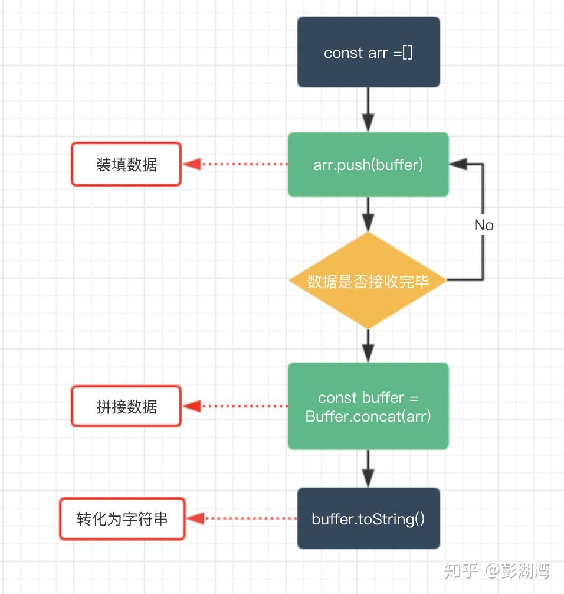

#  Blob ArrayBuffer Buffer base64 File
前端虽然不怎么需要处理文件，但是做上传文件这种需求的时候总会碰到。今天就来搞清楚他们之间的区别与联系吧！解决后顾之忧<br/>

## 概述
* Blob: 前端的一个专门用于支持文件操作的二进制对象
* ArrayBuffer: 前端的一个通用的二进制缓冲区。类似数组，但在API和特性上却有诸多不同
* Buffer：Node.js提供的一个二进制缓冲区，常用来处理I/O操作
### 关系图


## Blob
定义：Blob 对象表示一个不可变、原始数据的类文件对象<br/>
Blob是用来支持文件操作的。File继承了所有Blob的属性。<br/>
### 如何获取File
1. input标签上所选择的文件
2. 拖拽中生成的DataTransfer对象

File对象是一种特殊的Blob对象，可以调用Blob的所有方法。
### Blob常用方法 及 可以实现的功能
#### 1. 文件下载 
通过`URL.cretaeObjectURL(blob)`生成的Blob url,赋值给a.download即可完成下载功能。【download属性不兼容IE, 对IE可通过window.navigator.msSaveBlob方法或其他进行优化】

<iframe height="265" style="width: 100%;" scrolling="no" title="通过Blob实现下载" src="https://codepen.io/rsnowing-the-reactor/embed/gOrEzVy?height=265&theme-id=light&default-tab=js,result" frameborder="no" loading="lazy" allowtransparency="true" allowfullscreen="true">
  See the Pen <a href='https://codepen.io/rsnowing-the-reactor/pen/gOrEzVy'>通过Blob实现下载</a> by hell
  (<a href='https://codepen.io/rsnowing-the-reactor'>@rsnowing-the-reactor</a>) on <a href='https://codepen.io'>CodePen</a>.
</iframe>

#### 2. 图片显示
通过`URL.cretaeObjectURL(blob)`生成的Blob url,赋给img.src 即可展示

<iframe height="265" style="width: 100%;" scrolling="no" title="Blob实现图片本地显示" src="https://codepen.io/rsnowing-the-reactor/embed/jOqJxJP?height=265&theme-id=light&default-tab=js,result" frameborder="no" loading="lazy" allowtransparency="true" allowfullscreen="true">
  See the Pen <a href='https://codepen.io/rsnowing-the-reactor/pen/jOqJxJP'>Blob实现图片本地显示</a> by hell
  (<a href='https://codepen.io/rsnowing-the-reactor'>@rsnowing-the-reactor</a>) on <a href='https://codepen.io'>CodePen</a>.
</iframe>

#### 3. 资源分段上传
通过blob.slice可以分割二进制数据为子Blob上传

<iframe height="265" style="width: 100%;" scrolling="no" title="Blob实现文件分片上传" src="https://codepen.io/rsnowing-the-reactor/embed/BaKbVNB?height=265&theme-id=light&default-tab=js,result" frameborder="no" loading="lazy" allowtransparency="true" allowfullscreen="true">
  See the Pen <a href='https://codepen.io/rsnowing-the-reactor/pen/BaKbVNB'>Blob实现文件分片上传</a> by hell
  (<a href='https://codepen.io/rsnowing-the-reactor'>@rsnowing-the-reactor</a>) on <a href='https://codepen.io'>CodePen</a>.
</iframe>

#### 4. 本地读取文件
FileReader的API可以将Blob或Blob转化为文本 or ArrayBuffer or Data URL 等类型。<br/>

* FileReader.readAsText(Blob)：将Blob转化为文本字符串
* FileReader.readAsArrayBuffer(Blob)： 将Blob转为ArrayBuffer格式数据
* FileReader.readAsDataURL(): 将Blob转化为Base64格式的Data URL

##### 读取本地图片 获取base64链接
<iframe height="265" style="width: 100%;" scrolling="no" title="FileReader实现图片本地显示" src="https://codepen.io/rsnowing-the-reactor/embed/JjXmjdy?height=265&theme-id=light&default-tab=js,result" frameborder="no" loading="lazy" allowtransparency="true" allowfullscreen="true">
  See the Pen <a href='https://codepen.io/rsnowing-the-reactor/pen/JjXmjdy'>FileReader实现图片本地显示</a> by hell
  (<a href='https://codepen.io/rsnowing-the-reactor'>@rsnowing-the-reactor</a>) on <a href='https://codepen.io'>CodePen</a>.
</iframe>

##### 读取本地文件内容
<iframe height="265" style="width: 100%;" scrolling="no" title="读取本地文件内容" src="https://codepen.io/rsnowing-the-reactor/embed/KKzEeqa?height=265&theme-id=light&default-tab=js,result" frameborder="no" loading="lazy" allowtransparency="true" allowfullscreen="true">
  See the Pen <a href='https://codepen.io/rsnowing-the-reactor/pen/KKzEeqa'>读取本地文件内容</a> by hell
  (<a href='https://codepen.io/rsnowing-the-reactor'>@rsnowing-the-reactor</a>) on <a href='https://codepen.io'>CodePen</a>.
</iframe>


### Blob总结
Blob是针对文件的，或者可以说它就是一个文件对象，同时呢我们发现Blob欠缺对二进制数据的细节操作能力，比如如果如果要具体修改某一部分的二进制数据，Blob显然就不够用了，而这种细粒度的功能则可以由下面介绍的ArrayBuffer来完成。

## ArrayBuffer
### ArrayBuffer能力
1. 读取
通过FileReader将文件转化为ArrayBuffer数据
2. 写入
通过 TypeArray or DattaView对象进行操作

### 与js原生数组的区别
* ArrayBuffer初始化后固定大小， 数组可以自由增减
* 数组放在堆中，ArrayBuffer吧数据放在栈中
* ArrayBuffer没有push/pop等数组方法
* ArrayBuffer只能读不能写，写要借助TypeArray/DataView


## Buffer
Buffer是Node.js提供的对象，前端没有。 它一般应用于IO操作，例如接收前端请求数据时候，可以通过以下的Buffer的API对接收到的前端数据进行整合



## File


## base64
定义： Base64就是一种基于64个可打印字符来表示二进制数据的方法
### 使用场景
* 对证书来说，特别是根证书，一般都是作Base64编码的，因为它要在网上被许多人下载。
* 电子邮件的附件一般也作Base64编码的，因为一个附件数据往往是有不可见字符的。
* 网页中一些小图片可以直接以base64编码的方式嵌入。不用再用链接请求消耗资源

## 存储大小

## 互相转换
应该只有以下5种转化了，以后别想着转来转去啦 
### 1. file -> base64
```js
let reader = new FileReader();
reader.readAsDataURL(file)
console.log(reader)
```
```js
URL.createObjectURL(file)
```

### 2. base64 -> file
```js
 function base64ConvertFile(urlData, filename) { 
  if (typeof urlData != 'string') {
    console.error("urlData不是字符串")
    return;
  }
  let arr = urlData.split(',')
  let type = arr[0].match(/:(.*?);/)[1]
  let fileExt = type.split('/')[1]
  let bstr = atob(arr[1])
  let n = bstr.length
  let u8arr = new Uint8Array(n)
  while (n--) {
    u8arr[n] = bstr.charCodeAt(n);
  }
  return new File([u8arr], 'filename.' + fileExt, {
    type: type
  });
}
```

### 3. base64 -> blob
```js
function dataURItoBlob(dataURI) {  
  let byteString = atob(dataURI.split(',')[1]);  
  let mimeString = dataURI.split(',')[0].split(':')[1].split(';')[0];  
  let ab = new ArrayBuffer(byteString.length);  
  let ia = new Uint8Array(ab);  
  for (let i = 0; i < byteString.length; i++) {  
    ia[i] = byteString.charCodeAt(i);  
  }  
  return new Blob([ab], {type: mimeString});  
}
```

### 4. blob -> ArrayBuffer
```js
let blob = new Blob([1,2,3,4])
let reader = new FileReader();
reader.onload = function(result) {
  console.log(result);
}
reader.readAsArrayBuffer(blob);
```

### 5. buffer -> blob
```js
let blob = new Blob([buffer])
```


## 参考链接
* [知乎-聊聊JS的二进制家族：Blob、ArrayBuffer和Buffer](https://zhuanlan.zhihu.com/p/97768916)
* [掘金](https://juejin.im/post/6844904069165744135)
