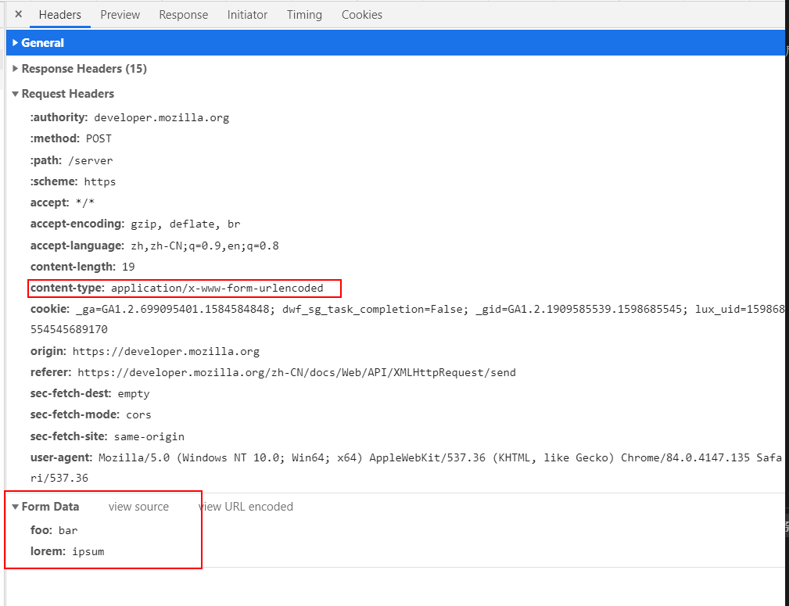
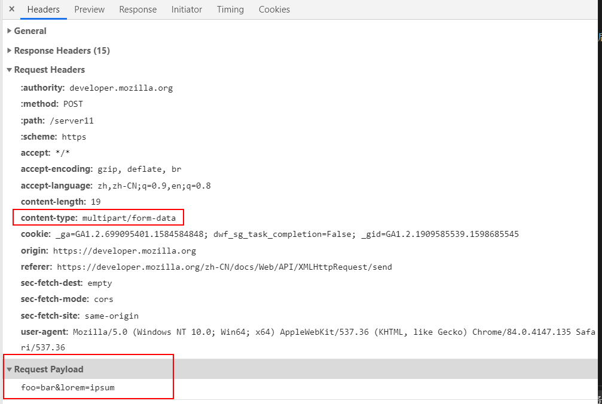
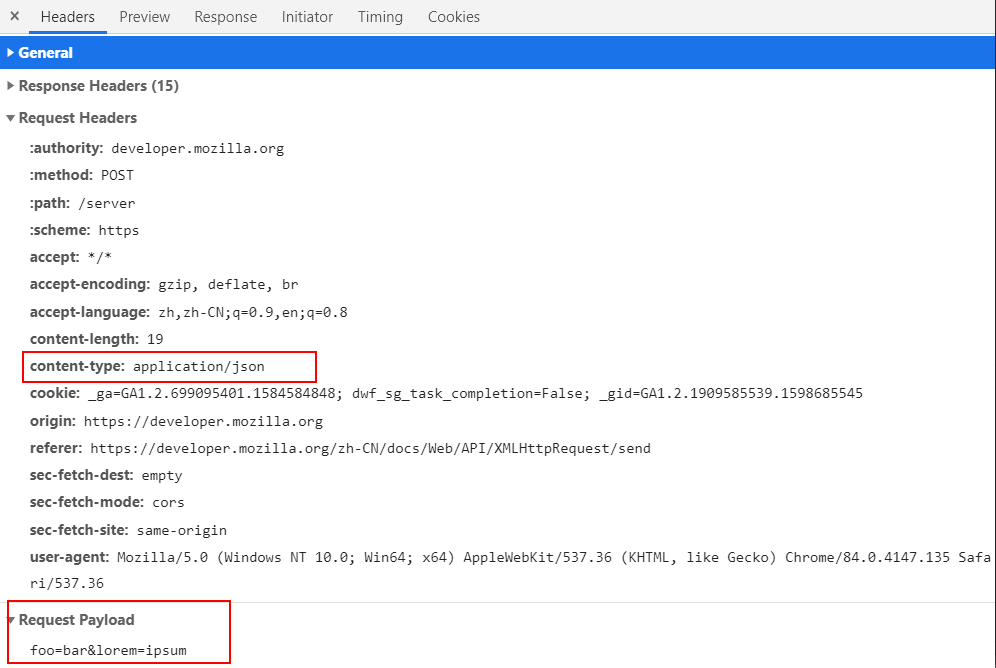

##  POST提交数据方式

### 概述
常见的http请求方法有get,post,put,delete,head,options等，客户端发送一个http请求到服务器，这个请求消息包括：请求行，请求头，空行和请求数据。

使用post发送的数据必须放在消息主体内，但是http协议并没有规定使用什么样的编码方式来传送数据。这个编码方式前端可以自己来决定，但是数据发出去，还要服务端能解析成功才有意义。服务端自有不同的方法来解析不同编码格式的数据，而且服务端可以根据请求头(headers)内的Content-Type字段去获知编码方式，然后去解析数据。

### 几种常见的Content-Type 类型
#### 1. application/x-www-form-urlencoded
我们在使用浏览器原生的form表单提交数据时，如果没有指定enctype属性，则默认会以该方式提交数据。
#### 2. multipart/form-data
当我们在上传图片或者文件的时候，会用到这种编码方式。
#### 3. application/json
以application/json作为响应头或者请求头都非常常见。这种编码方式会告诉服务端提交的数据类型是序列化后的JSON字符串，前端在调接口提交数据时，直接以对象形式传递数据即可。

### 测试这几种类型
#### application/x-www-form-urlencoded
```js
var xhr = new XMLHttpRequest();
xhr.open("POST", '/server', true);

//发送合适的请求头信息
xhr.setRequestHeader("Content-type", "application/x-www-form-urlencoded");

xhr.onload = function () { 
    // 请求结束后,在此处写处理代码
};
xhr.send("foo=bar&lorem=ipsum");
```
浏览器请求信息：


#### multipart/form-data
```js
var xhr = new XMLHttpRequest();
xhr.open("POST", '/server', true);

//发送合适的请求头信息
xhr.setRequestHeader("Content-type", "multipart/form-data");

xhr.onload = function () { 
    // 请求结束后,在此处写处理代码
};
xhr.send("foo=bar&lorem=ipsum");
```


#### application/json
```js
var xhr = new XMLHttpRequest();
xhr.open("POST", '/server', true);

//发送合适的请求头信息
xhr.setRequestHeader("Content-type", "application/json");

xhr.onload = function () { 
    // 请求结束后,在此处写处理代码
};
xhr.send("foo=bar&lorem=ipsum"); 
```
浏览器请求信息：


### 参考链接
* [这个文章不错](https://liyang0207.github.io/2019/03/30/POST%E6%8F%90%E4%BA%A4%E6%95%B0%E6%8D%AE%E7%9A%84%E5%87%A0%E7%A7%8D%E6%96%B9%E5%BC%8F/)
* [XMLHttpRequest发送请求](https://developer.mozilla.org/zh-CN/docs/Web/API/XMLHttpRequest/send)