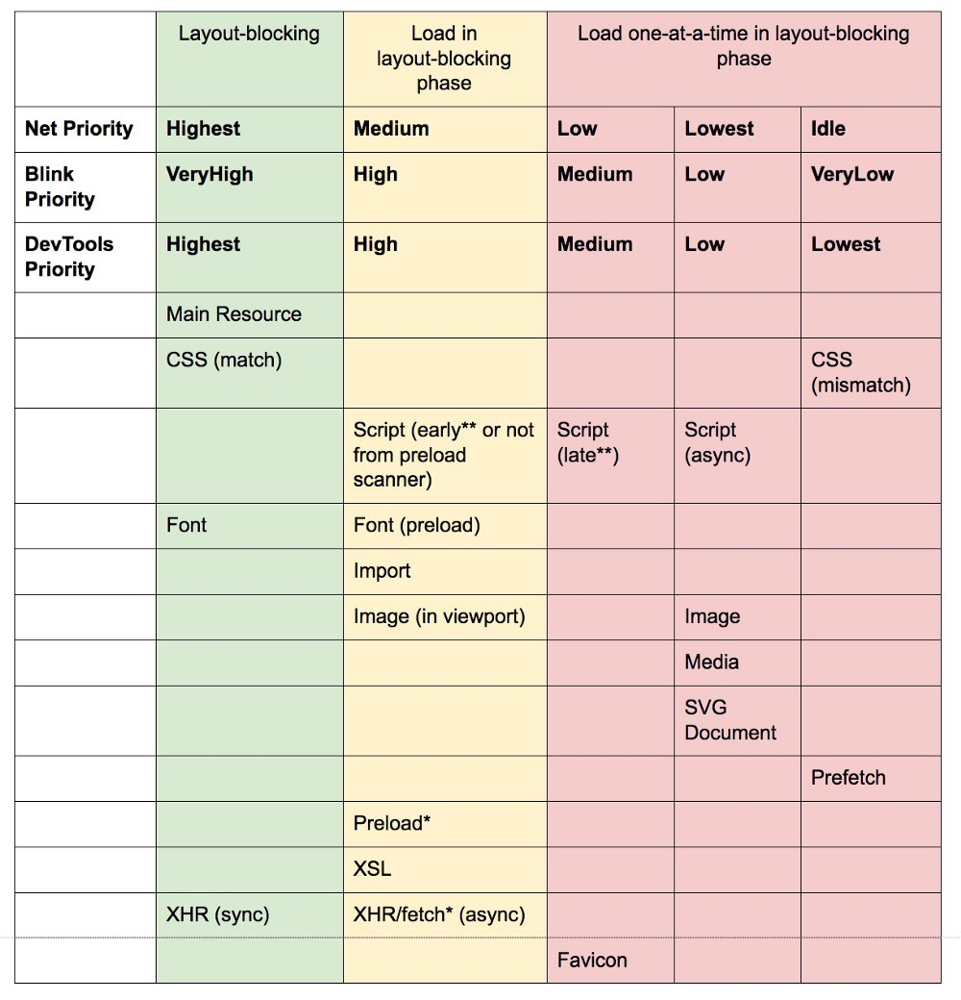

## preload prefetch
### 使用场景
对于当前页面很有必要的资源使用 preload，对于可能在将来的页面中使用的资源使用 prefetch。
### `<link rel="preload">` 和 `<link rel="prefetch">` 的缓存行为
chrome有4种缓存：HTTP缓存、内存缓存、Service Worker缓存 和 Push缓存。preload和prefetch都被存储在HTTP缓存中。
### chrome 对于 preload 和 prefetch 的网络优先级

### 参考链接
[掘金](https://juejin.im/post/58e8acf10ce46300585a7a42)