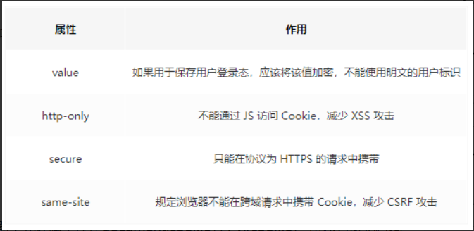

## 比较cookie、localStorage、sessionStorage、indexdb
| 存储方式       | 跨域     | 作用域  | 生命周期                                                     | 存储量                                     | 存储位置                                   |
| -------------- | ------------------------------------------------------------ | ------------------------------------------ | ------------------------------------------ | ------------------------------------------ | ------------------------------------------ |
| cookie         | 同源策略  |  | 默认保存在内存中，随浏览器关闭失效（如果设置过期时间，在到过期时间后失效） | 4KB                                        | 保存在客户端，每次请求时都会带上           |
| localStorage   | 同源策略 | 相同的协议、相同的主机名、相同的端口 | 理论上永久有效的，除非主动清除。                             | 4.98MB（不同浏览器情况不同，safari 2.49M） | 保存在客户端，不与服务端交互。节省网络流量 |
| sessionStorage | 同源策略 | 协议、主机名、端口相同，还要求在同一窗口 | 仅在当前网页会话下有效，关闭页面或浏览器后会被清除。         | 4.98MB（部分浏览器没有限制）               | 同上      |
| indexdb        |         |         |                                                              | 用于客户端存储大量结构化数据(包括文件和blobs) |                                            |

localStorage 适合持久化缓存数据，比如页面的默认偏好配置等；sessionStorage 适合一次性临时数据保存。

## cookie与安全

## 应用

sessionStorage 可以应用于对表单信息进行存储，刷新页面，表单信息不丢失。关闭窗口，销毁。