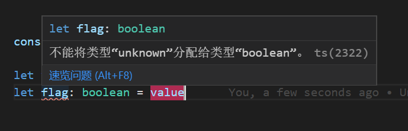

## 解释
never 表示那些永不存在的值的类型  
unknown 是any类型对应的安全类型  

## never
never 类型是任何类型的子类型，也可以赋值给任何类型；  
然而，没有类型是 never 的子类型或可以赋值给 never 类型（除了 never 本身之外）。   
即使 any 也不可以赋值给 never。

### 应用场景
1. 一个抛出异常的函数表达式，其函数返回值类型为 never：
```js
function error(message: string): never {
    throw new Error(message)
}
```
2. 不会有返回值的函数表达式，其函数返回值类型也为 never:
```js
// 推断的返回值类型为 never
function fail(): never {
    return error("Something failed")
}
```
3. 不能取得值的地方：
```js
interface Foo {
    type: 'foo'
}
interface Bar {
    type: 'bar'
}
// 类型别名（type）
// 联合类型（A | B）
type All = Foo | Bar
function handleValue(val: All) {
    switch (val.type) {
      case 'foo':
        break
      case 'bar':
        break
      default:
        // 此处不能取值
        const exhaustiveCheck: never = val
        break
    }
}
```

## unknown 类型
unknown 类型在被确定为某个类型之前，不能被进行诸如函数执行、实例化等操作，一定程度上对类型进行了保护。
```js
// unkonwn 类型可以被任意赋值，但是不可以赋给任意类型值
let value: unknown
value = true             // OK
value = 10               // OK
value = "Hello World"    // OK
value = []               // OK
value = {}               // OK
value = Math.random      // OK
value = null             // OK
value = undefined        // OK
value = new TypeError()  // OK
value = Symbol('name')   // OK
// --- 但是只能赋值给any 和 unknown --- //
let value1: unknown = value   // OK
let value2: any = value       // OK
// ---- 以下报错 ---- //
let value3: boolean = value   // Error
let value4: number = value    // Error
let value5: string = value    // Error
let value6: object = value    // Error
let value7: any[] = value     // Error
```

> 在那些将取得任意值，但不知道具体类型的地方使用 unknown，而非 any。


