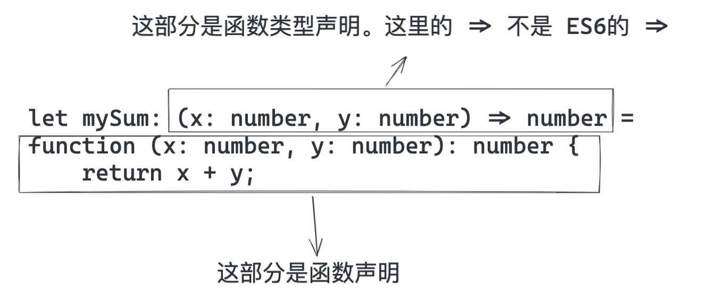

# TS中的一些关键词总结
## 符号
### ! 断言操作符
强制解析。 用于断言某个变量不会是null/undefined,告诉编辑器停止报错.[不会对运行有影响]

### ?. 链判断运算符
```ts
const orderId = response.result.data.orderId;
// 这种写法很容易出现出现某个值为null/undefined,导致取下一级时报错，js中可以使用&&解决。ts可以使用?.
const orderId1 = response?.result?.data?.orderId || '';
```
`?.`直接在链式调用的时候判断 左侧的对象是否为null/undefined，如果是不再往下计算，返回undefined。<br/>
`?.`支持的语法：
```
obj?.prop // 对象属性
obj?.[expr] // 对象属性
arr?.[index] // 获取数据中 index 下标对应的值
func?.(...args) // 函数或对象方法的调用
```
*** 
## 关键词
### type
type 用于给一个类型起一个别名。
```ts
type OptType = 'drag' | 'select'
const opt: OptType = 'drag'
```
### interface
用于定义类型
### typeof
获取一个变量的声明类型
```ts
const obj = { a: '1' };
type Foo = typeof obj; 
// type Foo = { a: string }
```
### keyof 
获取一个对象接口的所有 key 值
```ts
type Obj = { a: string; b: string }
type Foo = keyof obj;
// type Foo = 'a' | 'b';
```
### in
遍历枚举类型
```ts
type Keys = 'a' | 'b' | 'c';
type Obj = { 
  [T in Keys]: string;
}
```

*** 
## 类型推断
### 条件类型
`T extends U ? X : Y` 表示如果 T 包含的类型是 U 包含类型的”子集“，那么就取结果X，否则取结果 Y

### infer
表示待推断的类型
### 类型断言
语法：
```ts
值 as 类型 
// or
<类型>值
```

*** 
## 内置类型
* Partial<T> 将类型的属性变成可选
* Required<T>将类型的属性变成必选
* Pick 从某个类型中挑出一些属性出来
* Record
* Mutable<T> 将类型的属性变成可修改
* Readonly<T> 类型的属性变成只读
* ReturnType 用来得到一个函数的返回值类型

## TS中令人混淆的写法
容易混淆的箭头函数:


容易混淆的 interface 内的小括号: 


## 参考链接
* [github参考](https://github.com/funnycoderstar/blog/issues/160)
* [条件类型官方文档](https://www.typescriptlang.org/docs/handbook/release-notes/typescript-2-8.html)