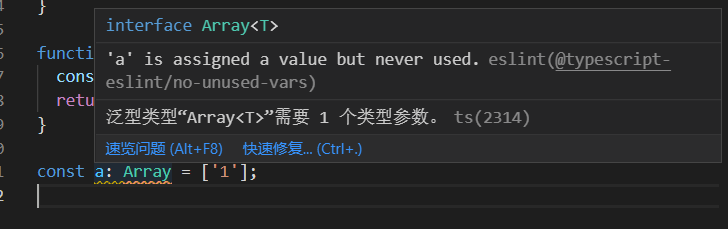

# 泛型 Generics
当你玩溜泛型，TS差不多就完全掌握了- 我觉得。<br/>
使用泛型，我们可以轻松地将那些输入重复的代码，构建为可复用的组件，这给予了开发者创造灵活、可重用代码的能力。<br/>
## 定义
指在定义函数,接口或类的时候不预先指定具体的类型,而是在使用的时候再指定类型.

## demo
```ts
function get(arg) {
  return arg
}
```
如上get函数,如果想要输入什么就得到什么的话,以上的写法不会报错,vscode给给一个提示"参数 "arg" 隐式具有 "any" 类型，但可以从用法中推断出更好的类型".<br/>如果使用 any 的话，怎么写都是 ok 的， 这就丧失了类型检查的效果。<br/>
使用泛型让编辑器不提示
```ts
function get<T>(arg: T): T {
  return arg
}
// 使用
get<string>('sdds') // 最完整的写法
// or
get('dd') // 基于类型推导，我们可以这样简写
```

### 泛型约束
```ts
interface Sizeable {
  size: number;
}
function trace<T extends Sizeable>(arg: T): T {
  console.log(arg.size);
  return arg;
}
```

### 默认参数
```ts
type A<T = string> = Array<T>;
const aa: A = [1]; // type 'number' is not assignable to type 'string'.
const bb: A = ["1"]; // ok
const cc: A<number> = [1]; // ok
```


## 常见的泛型
### 集合类
类似 Array<String>这种写法.<br/>
直接给变量赋值Array类型是会报错的. 


## 什么时候使用泛型
* 需要作用到很多类型的时候
* 需要被用到很多地方的时候

## 参考链接
* [你不知道的 TypeScript 泛型（万字长文，建议收藏） | lucifer的网络博客](https://lucifer.ren/blog/2020/06/16/ts-generics/)