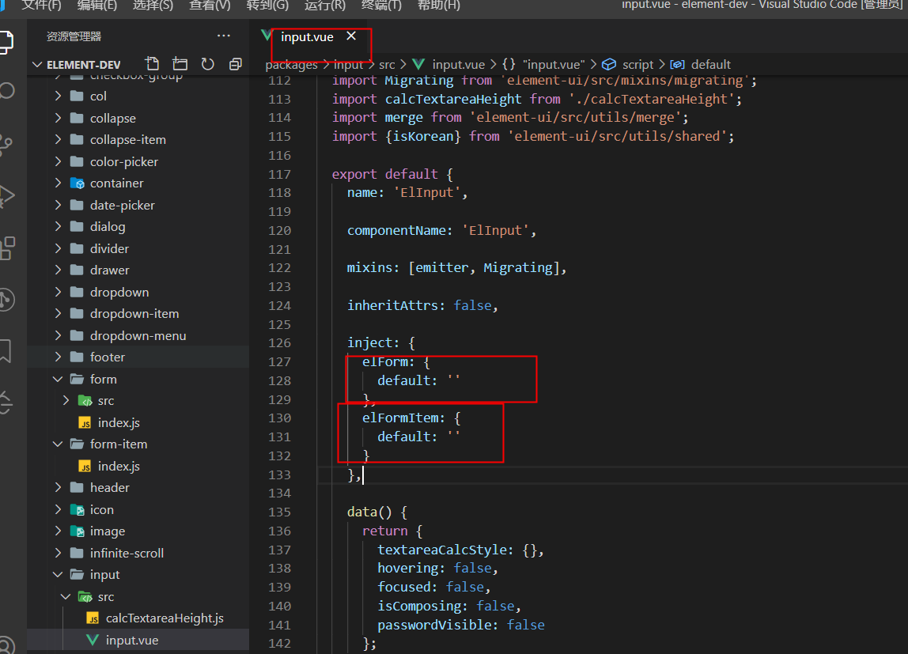

### vue 父子组件传值 provide-inject
这对选项需要一起使用，以允许一个祖先组件向其所有子孙后代注入一个依赖，不论组件层次有多深，并在起上下游关系成立的时间里始终生效。
### 应用场景：
你是否也曾好奇，为什么elementui里面，给el-form设置size, button啦，input啦size都变化了，难道他是用的prop一层层传递值吗，这也太low了吧。今天看了下源码，果然，是provide-inject！
1. 在form组件中注册provide
  
2. 在子组件form-item中注入 elForm
  
3. size 的改变就可以依赖这个elForm里面的属性了
  

  在input组件中会导入父级和父级的父级的provider
  

### 忏悔
发现这个属性之后，我为我曾经写过的多级组件，并且一层层传prop的行为感到羞耻！！！

### 组件通信方式总结
0. $refs
1. prop
2. $emit
3. vuex
4. provide、inject
5. $dispatch、$broadcast

### 参考链接
[vue](https://cn.vuejs.org/v2/api/#provide-inject)
[$dispatch、$broadcast](https://juejin.im/post/5c7fd345f265da2da771f4cd)