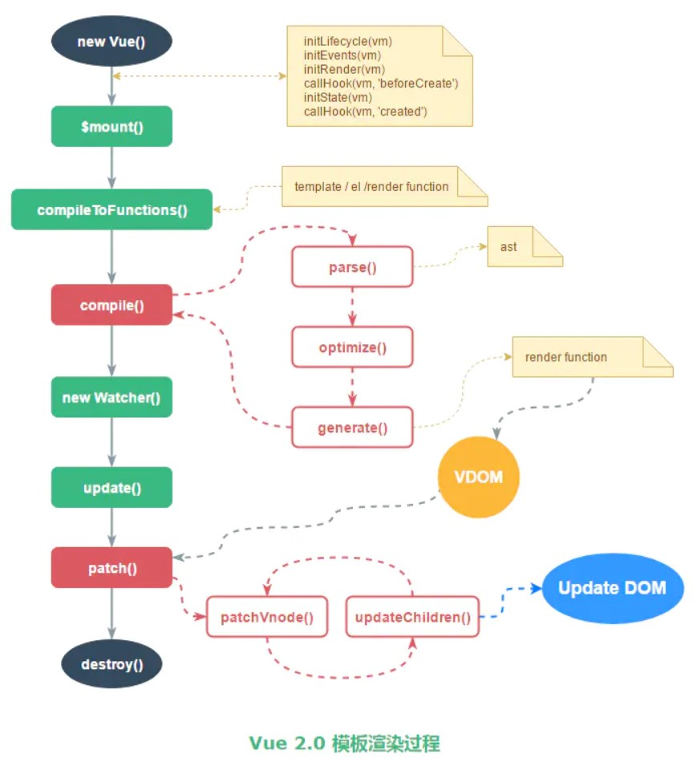

## vue 源码导读
### 需要完成的目标
- [ ] 生命周期的实现
- [ ] new Vue 做了什么
- [ ] 模板的渲染
- [ ] 数据的双向绑定
- [ ] 如何自己实现一个双向绑定方案

### 版本

2.6.11

### 入口

核心代码在src/core目录下

### 调试说明

修改vue文件下的package.json：添加--sourcemap

```
"dev": "rollup -w -c scripts/config.js --environment TARGET:web-full-dev --sourcemap"
```

npm run dev   会在dist目录下生成vue.js.map文件
在examples/commits/index.html 中引入dist/vue.js，运行html,就可以进行调试啦

### 调试快捷键说明

```js
f9 单步执行 遇到方法 跳到方法里
f10 单步执行 遇到方法 不跳到方法里
f11 跳过当前方法
shift + f11 跳出当前方法
```

### 记录

```js
beforeCreate -> create -> $mounte -> beforeMount - > beforeUpdate注册 -> mounted
$mount:

模板的渲染： document.getElementByOd('app').outerHTML
AST 语法树
createCompiler
parse => Convert HTML string to AST.
parseHTML 
html-parser.js
optimize AST =? optimizer.js => 优化了什么呢
markStatic,markStaticRoots
generate
checkNode

lifecycle.js
```




### 参考链接

[github vue源码导读](https://github.com/muwoo/blogs/blob/master/src/Vue/1.md)    
[调试vue源码](https://juejin.im/post/5efb634bf265da22ab2d4b07)      
[生啃vue源码](https://juejin.im/post/5f02f0bdf265da22ef7dbe5d)      
[chrome调试](https://developers.google.com/web/tools/chrome-devtools/javascript?hl=zh-cn)     
[vue-prase 理解](https://juejin.im/post/5d09a4fef265da1b6b1cd96b#heading-13)        
[vue使用技巧](https://juejin.im/post/5ef6d1325188252e75366ab5)      

