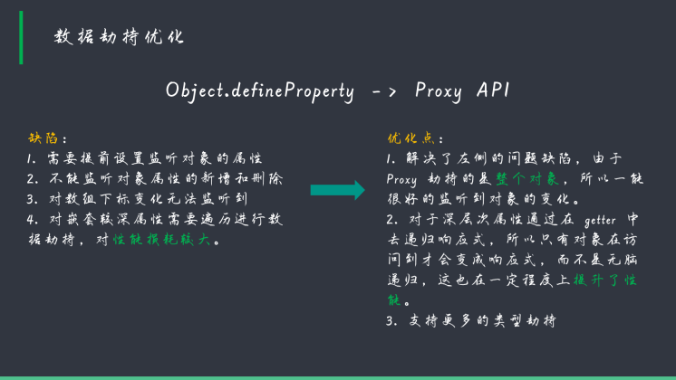
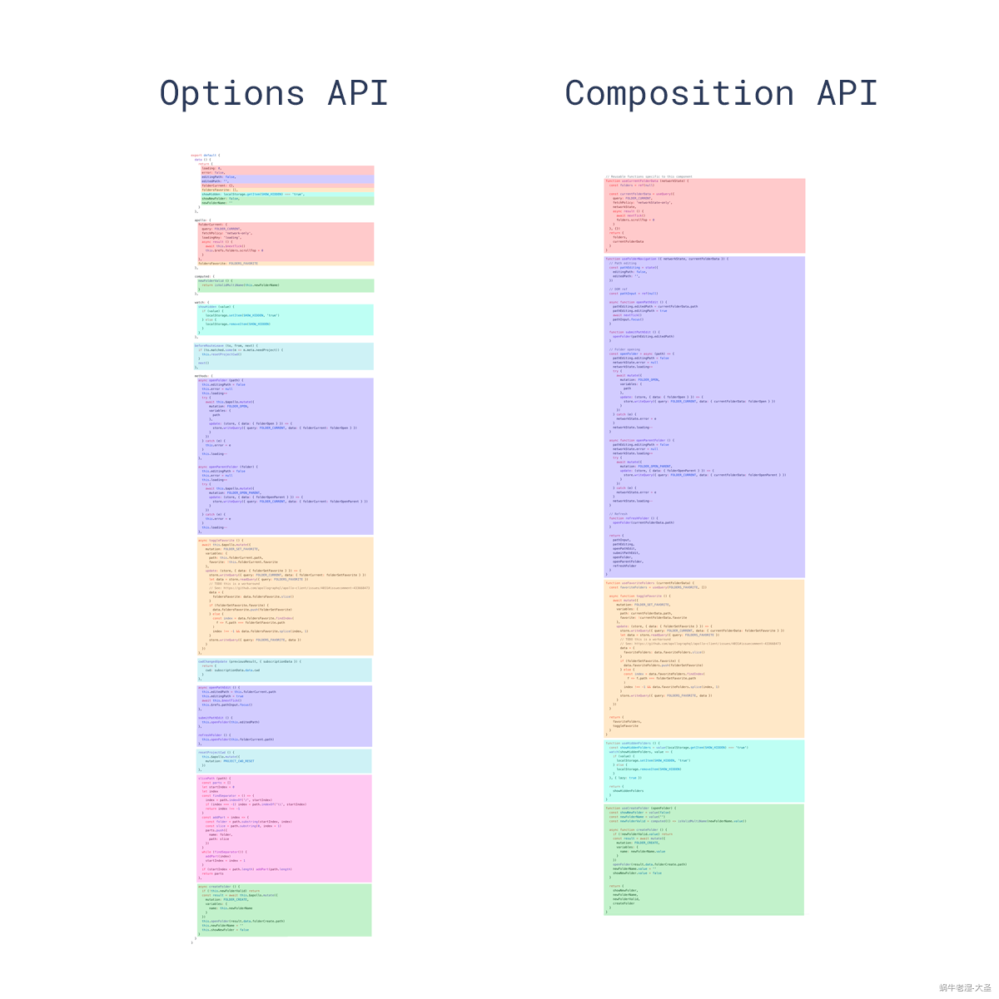

# vue3入门

## 为什么要有vue3?

### vue2 遇到的难题
* 随着功能的增长，复杂组件的代码变得难以维护。
按逻辑归类【vue2中可以使用mixin】
* vue2对于TS的支持非常有限

## vue3的改变

### 性能提升 【虚拟DOM重新实现 + tree shaking优化】
* 打包大小减少41%
* 初次渲染快55%，更新快133%
* 内存使用减少54%

### composition API 组合式API 💥
* ref和reactive
* computed 和 watch
* 新的生命周期函数
* 自定义函数 - Hooks函数

### 其他新增特性
* Teleport 瞬移组件的位置
* Suspense 异步加载组件的福音
* 全局API的优化和修改
* 更多的实验性特性

### 更好的TS支持

## vue3 周边生态
### 1. 开发四剑客
 vue cli 4.5.0, vue-router 4.0, vuex 4.0, vue devtool 已支持vue3
* [vue-router](https://v3.cn.vuejs.org/guide/routing.html#%E4%BB%8E%E9%9B%B6%E5%BC%80%E5%A7%8B%E7%AE%80%E5%8D%95%E7%9A%84%E8%B7%AF%E7%94%B1)
* [vuejs devtools](https://chrome.google.com/webstore/detail/vuejs-devtools/ljjemllljcmogpfapbkkighbhhppjdbg?utm_source=chrome-ntp-icon)
* [状态管理vuex](https://v3.cn.vuejs.org/guide/state-management.html#%E7%B1%BB-flux-%E7%8A%B6%E6%80%81%E7%AE%A1%E7%90%86%E7%9A%84%E5%AE%98%E6%96%B9%E5%AE%9E%E7%8E%B0)
### 2. UI 组件库
1. PC: [element plus](https://element-plus.gitee.io/#/zh-CN/component/installation) 
2. 移动端： [vant next](https://vant-contrib.gitee.io/vant/next/#/zh-CN/quickstart)
...本人用的较多的组件库就这两个 但是都准备好vue3版本了

## 为什么要使用vue3
### 更好的类型支持
可以更好的借助开发工具的类型推导能力识别参数类型；使用TS开发时类型更加明确，
### 性能优化
1. 源码体积优化 
* 移出了一些冷门的特性 如filter，inline-template
* 引入tree-shaking技术，用到什么引用什么，减小打包体积
2. 数据劫持优化
Object.defineProperty -> Proxy

3. 编译优化
4. 语法API优化【变得更像react了。。】
组合式API更利于代码的复用。（minxin数据来源不清晰）

## 值得注意的新特性
* [值得注意的新特性](https://v3.cn.vuejs.org/guide/migration/introduction.html#%E5%BF%AB%E9%80%9F%E5%BC%80%E5%A7%8B)
1. 组合式api
2. teleport
3. template
支持多根节点了！
* [片段](https://v3.cn.vuejs.org/guide/migration/fragments.html#%E6%A6%82%E8%A7%88)

4. 自定义事件
* 不再支持camelCase 和 kebab-case事件名的自动转换。【prop和组件名还是支持的】，官方推荐始终使用kebab-case格式
* 需要主动去定义自定义事件
在emits选项中加入自定义事件名 =》 可以更好地归纳组件拥有哪些自定义事件
* v-model 变成 `:modelValue ` 和  `update:modelValue` 的语法糖
* 可以支持多个v-model啦！ 抛弃sync语法
* [自定义事件](https://v3.cn.vuejs.org/guide/component-custom-events.html#%E4%BA%8B%E4%BB%B6%E5%90%8D)

5. 单文件组合式api语法糖 (script setup)
* [说明](https://github.com/vuejs/rfcs/blob/sfc-improvements/active-rfcs/0000-sfc-script-setup.md)
6. 单文件组件状态驱动的CSS变量（style vars）
* [说明](https://github.com/vuejs/rfcs/blob/sfc-improvements/active-rfcs/0000-sfc-style-variables.md)
7. 单文件组件(style scoped)现在可以包含全局规则或只针对插槽内容的规则
* [说明](https://github.com/vuejs/rfcs/blob/master/active-rfcs/0023-scoped-styles-changes.md)

## 原有API的变更
1. 生命周期：destoryed -> unmounted; beforeDestroy -> beforeUnmount（选项式API）
2. 属性可以直接作用与子组件特定元素
...

## 参考链接