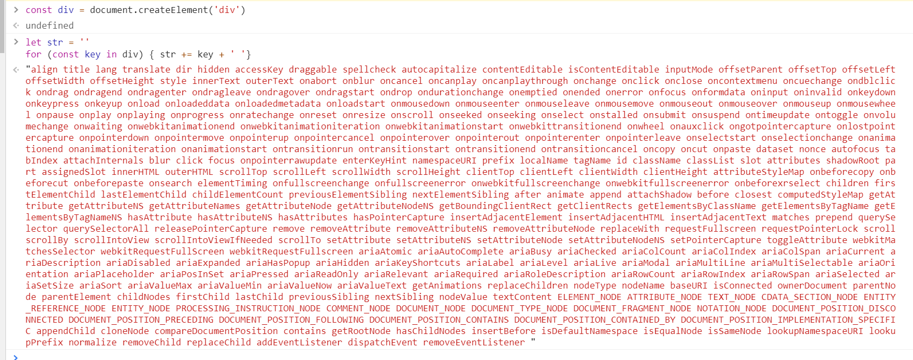

# Virtual DOM
Virtual DOM的概念大规模的推广得益于react的出现，vdom也是react框架比较重要的特性之一。相比较频繁的手动去操作dom而带来性能问题，vdom很好的将dom做了一层映射关系，进而将在我们本需要直接进行dom的一系列操作，映射到了操作vdom。

Virtual DOM 产生的前提是浏览器中的 DOM 是很“昂贵"的，为了更直观的感受，我们可以简单的把一个简单的 div 元素的属性都打印出来，如图所示：

可以看到，真正的 DOM 元素是非常庞大的，因为浏览器的标准就把 DOM 设计的非常复杂。当我们频繁的去做 DOM 更新，会产生一定的性能问题。

Vue.js 2.0引入vdom,比Vue.js 1.0的初始渲染速度提升了 2-4 倍，并大大降低了内存消耗

而 Virtual DOM 就是用一个原生的 JS 对象去描述一个 DOM 节点，所以它比创建一个 DOM 的代价要小很多。在 Vue.js 中，Virtual DOM 是用 VNode 这么一个 Class 去描述.

```js
// src/core/vdom/vnode.js
// 可以看到 VNode 是一个类，有很多属性。每一个vnode都映射到一个真实的dom节点上
export default class VNode {
  tag: string | void; // 对应真实节点的标签名
  data: VNodeData | void; // 当前节点的相关数据（节点上的class,attribute,style以及绑定的事件），是 VNodeData 类型。该类型声明在 flow/vnode.js 中, 见下
  children: ?Array<VNode>; // vnode的子节点
  text: string | void; // 当前节点的文本
  elm: Node | void; // 当前虚拟节点对应的真实节点
  ns: string | void;
  context: Component | void; // rendered in this component's scope
  key: string | number | void;
  componentOptions: VNodeComponentOptions | void;
  componentInstance: Component | void; // component instance
  parent: VNode | void; // component placeholder node // 当前节点的父节点

  // strictly internal
  raw: boolean; // contains raw HTML? (server only)
  isStatic: boolean; // hoisted static node
  isRootInsert: boolean; // necessary for enter transition check
  isComment: boolean; // empty comment placeholder?
  isCloned: boolean; // is a cloned node?
  isOnce: boolean; // is a v-once node?
  asyncFactory: Function | void; // async component factory function
  asyncMeta: Object | void;
  isAsyncPlaceholder: boolean;
  ssrContext: Object | void;
  fnContext: Component | void; // real context vm for functional nodes
  fnOptions: ?ComponentOptions; // for SSR caching
  devtoolsMeta: ?Object; // used to store functional render context for devtools
  fnScopeId: ?string; // functional scope id support

  constructor (
    tag?: string,
    data?: VNodeData,
    children?: ?Array<VNode>,
    text?: string,
    elm?: Node,
    context?: Component,
    componentOptions?: VNodeComponentOptions,
    asyncFactory?: Function
  ) {
    this.tag = tag
    this.data = data
    this.children = children
    this.text = text
    this.elm = elm
    this.ns = undefined
    this.context = context
    this.fnContext = undefined
    this.fnOptions = undefined
    this.fnScopeId = undefined
    this.key = data && data.key
    this.componentOptions = componentOptions
    this.componentInstance = undefined
    this.parent = undefined
    this.raw = false
    this.isStatic = false
    this.isRootInsert = true
    this.isComment = false
    this.isCloned = false
    this.isOnce = false
    this.asyncFactory = asyncFactory
    this.asyncMeta = undefined
    this.isAsyncPlaceholder = false
  }

  // DEPRECATED: alias for componentInstance for backwards compat.
  /* istanbul ignore next */
  get child (): Component | void {
    return this.componentInstance
  }
}
```
VNodeData定义
```js
// flow/vnode.js
declare interface VNodeData {
  key?: string | number;
  slot?: string;
  ref?: string;
  is?: string;
  pre?: boolean;
  tag?: string;
  staticClass?: string;
  class?: any;
  staticStyle?: { [key: string]: any };
  style?: string | Array<Object> | Object;
  normalizedStyle?: Object;
  props?: { [key: string]: any };
  attrs?: { [key: string]: string };
  domProps?: { [key: string]: any };
  hook?: { [key: string]: Function };
  on?: ?{ [key: string]: Function | Array<Function> };
  nativeOn?: { [key: string]: Function | Array<Function> };
  transition?: Object;
  show?: boolean; // marker for v-show
  inlineTemplate?: {
    render: Function;
    staticRenderFns: Array<Function>;
  };
  directives?: Array<VNodeDirective>;
  keepAlive?: boolean;
  scopedSlots?: { [key: string]: Function };
  model?: {
    value: any;
    callback: Function;
  };
};
```

## Virtual DOM是什么
本质上来说,dom只是一个简单的js对象，并且最少包含tag、props和children三个属性.

举个例子
```js
<div>
  Hello jack-cool
  <ul>
    <li id="1" class="li-1">
      hello
    </li>
  </ul>
</div>
```
vdom和dom对象有着一一对应的关系，上面的html对应生成的vdom如下:
```js
{
    tag: "div",
    props: {},
    children: [
        "Hello jack-cool",
        {
            tag: "ul",
            props: {},
            children: [{
                tag: "li",
                props: {
                    id: 1,
                    class: "li-1"
                },
                children: ["hello"]
            }]
        }
    ]
}
```

## Virtual DOM 有什么作用？
vdom的最终目标是将vnode渲染到视图上。但是如果直接使用新节点覆盖旧节点的话，会有很多不必要的DOM操作。

来看下引入vdom前后，实现视图更新的不同流程:

### 前
* 数据 + 模板生成真实 DOM
* 数据发生改变
* 新的数据 + 模板生成新的 DOM
* 新的 DOM 替换掉原来的 DOM
这么做的缺点在于：即使模板中只有一个元素发生了变化，也会把整个模板替换掉。例如，一个ul标签下很多个li标签，其中只有一个li有变化，这种情况下如果使用新的ul去替代旧的ul,会有很多不必要的DOM操作而造成性能上的损失。

为了避免不必要的DOM操作，vdom在vnode映射到视图的过程中，将vnode与上一次渲染视图所使用的旧虚拟节点（oldVnode）做对比，找出真正需要更新的节点来进行DOM操作，从而避免操作其他无需改动的DOM。

### 后
* 数据 + 模板生成虚拟 DOM
* 虚拟 DOM 生成真实 DOM
* 数据发生改变
* 新的数据 + 模板生成新的虚拟 DOM 而不是真实 DOM
* 用新的虚拟 DOM 和原来的虚拟 DOM 作对比（diff 算法，后面会详细介绍）【性能 up↑】
* 找出发生改变的元素
* 直接修改原来的真实 DOM【性能 up↑】


实际上 Vue.js 中 Virtual DOM 是借鉴了一个开源库 [snabbdom](https://github.com/snabbdom/snabbdom) 的实现，然后加入了一些 Vue.js 特色的东西。

## 总结
其实 VNode 是对真实 DOM 的一种抽象描述，它的核心定义无非就几个关键属性，标签名、数据、子节点、键值等，其它属性都是用来扩展 VNode 的灵活性以及实现一些特殊 feature 的。由于 VNode 只是用来映射到真实 DOM 的渲染，不需要包含操作 DOM 的方法，因此它是非常轻量和简单的。

Virtual DOM 除了它的数据结构的定义，映射到真实的 DOM 实际上要经历 VNode 的 create、diff、patch 等过程。

## 为什么要有虚拟DOM? 
* [网上都说操作真实 DOM 慢，但测试结果却比 React 更快，为什么？ - 知乎尤大的回答](https://www.zhihu.com/question/31809713/answer/53544875)

为何需要Virtual DOM？
* 具备跨平台的优势
由于 Virtual DOM 是以 JavaScript 对象为基础而不依赖真实平台环境，所以使它具有了跨平台的能力，比如说浏览器平台、Weex、Node 等。

* 操作 DOM 慢，js运行效率高。我们可以将DOM对比操作放在JS层，提高效率。
因为DOM操作的执行速度远不如Javascript的运算速度快，因此，把大量的DOM操作搬运到Javascript中，运用patching算法来计算出真正需要更新的节点，最大限度地减少DOM操作，从而显著提高性能。

* 提升渲染性能
Virtual DOM的优势不在于单次的操作，而是在大量、频繁的数据更新下，能够对视图进行合理、高效的更新。

