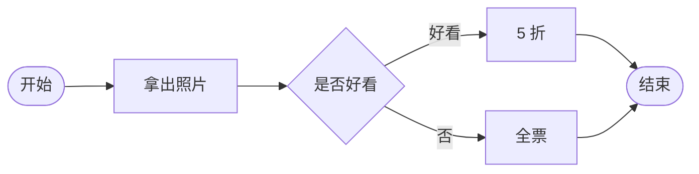

# docsify 使用说明
## 使用docsify画流程图
### 引入流程
```js
// 引入 mermaid
//  <link rel="stylesheet" href="//cdn.jsdelivr.net/npm/mermaid/dist/mermaid.min.css">
//  <script src="//cdn.jsdelivr.net/npm/mermaid/dist/mermaid.min.js"></script>

var num = 0;
mermaid.initialize({ startOnLoad: false });

window.$docsify = {
  markdown: {
    renderer: {
      code: function(code, lang) {
        if (lang === "mermaid") {
          return (
            '<div class="mermaid">' + mermaid.render('mermaid-svg-' + num++, code) + "</div>"
          );
        }
        return this.origin.code.apply(this, arguments);
      }
    }
  }
}
```
### 如何画
```
graph LR
A([开始]) -->B[拿出照片]
    B --> C{是否好看}
    C -->|好看| D[5 折]
    C -->|否| E[全票]
    D --> F([结束])
    E --> F([结束])
```
效果图


### 流程图语法说明
```
graph 方向描述  
图表中的其他语句...  
```
方向描述：  

| 值    | 描述     |
| ----- | -------- |
| TB/TD | 从上到下 |
| BT    | 从下到上 |
| RL    | 从右到左 |
| LR    | 从左到右 |

常用图形：

| 值    | 描述     |
| ----- | -------- |
| id[流程] | 矩形节点 |
| id1([开始或结束])  | 大圆角 |
| id{判定}    |  菱形节点|

箭头：

| 值    | 描述     |
| ----- | -------- |
| A-->B | 箭头 |
| A-- 描述文字 --->B  | 带文字的箭头 |

## docisify 使用全局搜索
```js
// 引入js文件 需要在docsify.min.js之后引入
<script src="//cdn.jsdelivr.net/npm/docsify/lib/plugins/search.min.js"></script>
```

## 复制到剪切板
```js
// 引入js文件
<script src="//cdn.jsdelivr.net/npm/docsify-copy-code"></script>
```

## 参考链接
[docsify文档](https://docsify.js.org/?utm_source=hacpai.com#/zh-cn/markdown?id=%e6%94%af%e6%8c%81-mermaid)  
[docsify中文文档](https://docsify.js.org/#/zh-cn/markdown)   
[流程图语法](https://www.geek-share.com/detail/2731174284.html)  
[流程图语法官方文档](https://mermaid-js.github.io/mermaid/#/flowchart)  
[docsify插件文档](https://docsify.js.org/#/plugins)  
[全局搜索插件使用](https://www.lizenghai.com/archives/87457.html)  