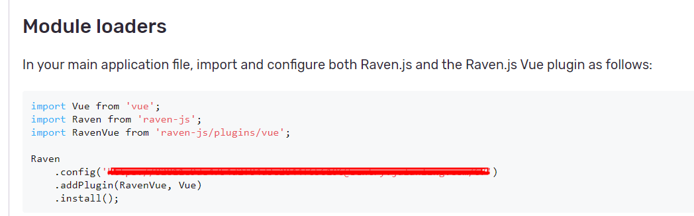

## vue项目中接入sentry
### 安装
`npm install raven-js --save`
### 引用
```js
// main.js
import Vue from 'vue';
import Raven from 'raven-js';
import RavenVue from 'raven-js/plugins/vue';

if (process.env.NODE_ENV !== 'development') {
  Raven
    .config('这里的信息-》下图打码处',
      { environment: location.hostname, serverName: location.hostname })
    .addPlugin(RavenVue, Vue)
    .install()
}
```


### 测试
```js
// 主动触发
Raven.captureMessage('我是上报的信息', {
  level: 'log'
})
```
### 参考连接
[简书](https://www.jianshu.com/p/66e00077fac3)