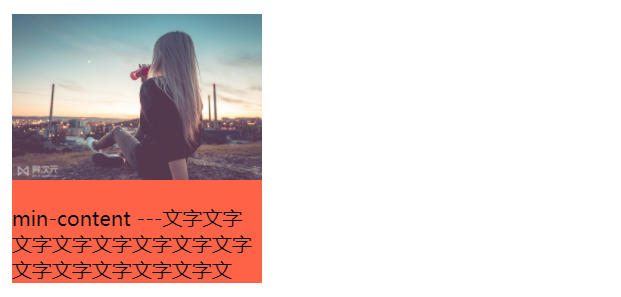
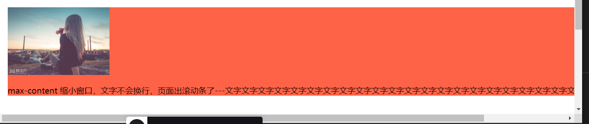

## min-height 与 height
2020-09-17
### min-height 
min-height 设置元素的最小高度。
* 当min-height > max-height 或者 min-height > height 时，元素高度 = min-height
* 当min-height < 内容高度， 元素高度 = 内容高度

### 取值为百分比时
百分比的大小时相对于直系父元素的高的大小。【直系父元素有固定的高度值才能使百分比高度生效】

### CSS3 height新增属性【width 也有这些属性】
入行2年多了，2年多还没有以下属性。[2年前只有百分比和数字,initial or inherit;] <br/>
目前都是实验属性，但是移动端基本都可以带浏览器前缀使用
* max-content 元素内容固有的（intrinsic）合适高度
* min-content 元素内容固有的最小高度。
* fit-content 取max-content， min-content两种值中的较大值


### 铺满屏幕的布局方法
```css
html {
  height: 100%;
}
body: {
  min-height: 100%
}
```

### 说一下width的新属性

#### min-content：宽度以内部内容最小宽度为准

#### max-content：宽度以内部内容最大宽度为准

#### fill-available 让元素的100%自动填充特性不仅仅在block水平元素上，也可以应用在其他元素(inline-block)

#### fit-content：表示将元素宽度收缩为内容宽度

### 写了个demo
<iframe height="415" style="width: 100%;" scrolling="no" title="fit-content" src="https://codepen.io/rsnowing-the-reactor/embed/bGpxwKY?height=415&theme-id=light&default-tab=html,result" frameborder="no" loading="lazy" allowtransparency="true" allowfullscreen="true">
  See the Pen <a href='https://codepen.io/rsnowing-the-reactor/pen/bGpxwKY'>fit-content</a> by hell
  (<a href='https://codepen.io/rsnowing-the-reactor'>@rsnowing-the-reactor</a>) on <a href='https://codepen.io'>CodePen</a>.
</iframe>


### 参考链接
* [height与min-height的百分比问题和铺满屏幕的布局方法](https://www.cnblogs.com/rockyren/p/4094425.html)
* [css3 width新增属性max/min-content和fit-content、fill-availablea](https://blog.csdn.net/wei_dan1129/article/details/105246728)