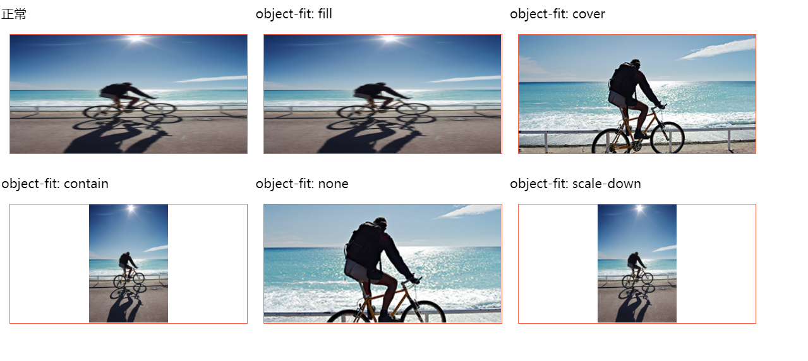

## object-fit
### 替换元素
> 其内容不受CSS视觉格式化模型控制的元素,比如image,嵌入的文档(iframe之类),叫做替换元素。浏览器根据元素的标签和属性，来决定元素的具体显示内容。
html中的``、`<input>`、`<textarea>`、`<select>`、`<object>`都是替换元素。这些元素往往没有实际的内容，即是一个空元素。

### object-fit
| 参数       | 取值                                                         |
| ---------- | ------------------------------------------------------------ |
| fill       | 默认值。被替换的内容大小可以填充元素的内容框。 整个对象将完全填充此框。 如果对象的高宽比不匹配其框的宽高比，那么该对象将被拉伸以适应 |
| contain    | 被替换的内容将被缩放，以在填充元素的内容框时保持其宽高比。 整个对象在填充盒子的同时保留其长宽比，因此如果宽高比与框的宽高比不匹配，该对象将被添加黑边 |
| cover      | 被替换的内容大小保持其宽高比，同时填充元素的整个内容框。 如果对象的宽高比与盒子的宽高比不匹配，该对象将被剪裁以适应 |
| none       | 被替换的内容大小保持其宽高比，而且被替换的内容尺寸不会被改变 |
| scale-down | 内容的尺寸就像是指定了none或contain，取决于哪一个将导致更小的对象尺寸 |

### 表现形式

### 使用
视频全屏播放， 在某些手机中两侧会由黑边，解决方案，使用 `object-fit: cover`
### 参考链接
* [object-fit 使用](https://juejin.im/post/6844903671919017998)