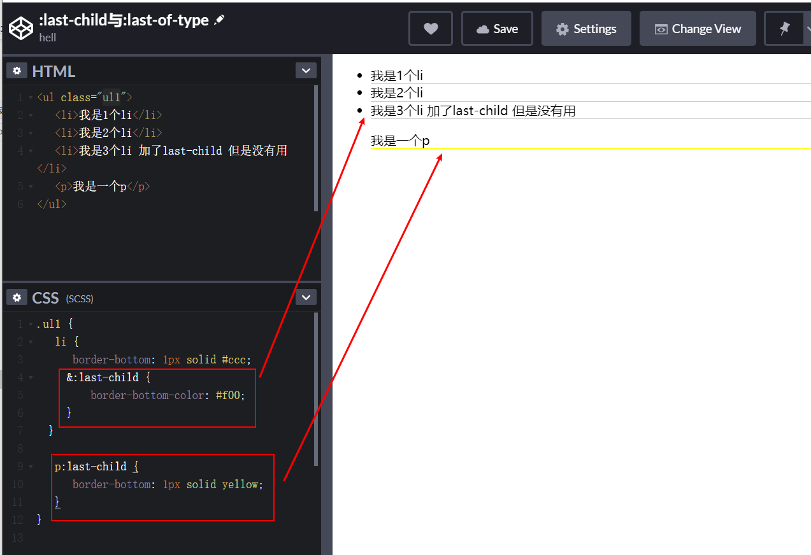
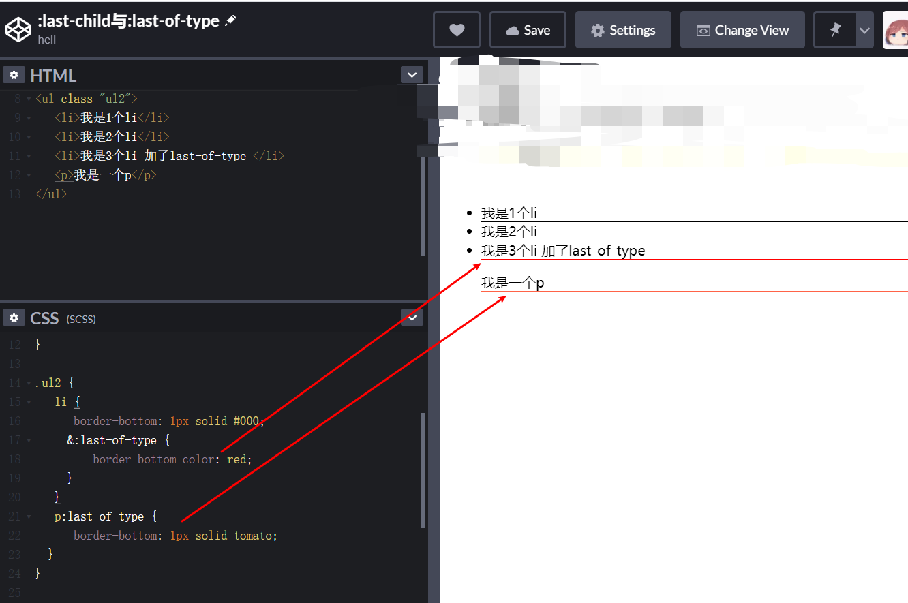

## last-child
CSS伪类:last-child代表在一群兄弟元素中的最后一个元素。且这个元素是css指定的元素，才可以生效。

## last-of-type
CSS伪类:last-of-type代表在一群兄弟元素中的最后一个指定类型的元素。

## 在线demo

<iframe height="265" style="width: 100%;" scrolling="no" title=":last-child与:last-of-type" src="https://codepen.io/rsnowing-the-reactor/embed/mdPgRrV?height=265&theme-id=light&default-tab=css,result" frameborder="no" loading="lazy" allowtransparency="true" allowfullscreen="true">
  See the Pen <a href='https://codepen.io/rsnowing-the-reactor/pen/mdPgRrV'>:last-child与:last-of-type</a> by hell
  (<a href='https://codepen.io/rsnowing-the-reactor'>@rsnowing-the-reactor</a>) on <a href='https://codepen.io'>CodePen</a>.
</iframe>

## 参考链接
* [w3school CSS选择器参考手册](https://www.w3school.com.cn/cssref/css_selectors.asp)
* [掘金](https://juejin.im/entry/6844903481652822023)