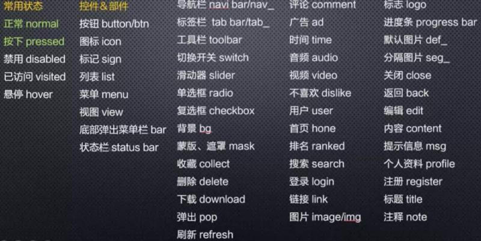

每次给样式起名都会花比写样式更长的时间，有时候写完了又会觉得自己为啥要起这么low的名字...今个就来把起名中常用的词汇捋一捋。

我记得我刚入行的时候，我一个师父和我说，css起名尽量不要跟业务相关，要有概括性。

## BEM 规范
Bem 是块（block）、元素（element）、修饰符（modifier）的简写，    
> -中划线 ：仅作为连字符使用，表示某个块或者某个子元素的多单词之间的连接记号。<br/>
__ 双下划线：双下划线用来连接块和块的子元素<br/>
_ 单下划线：单下划线用来描述一个块或者块的子元素的一种状态<br/>
### BEM  命名模式
可以参考element-ui 的CSS命名方式
```js
.el-button {}
.el-button--primary {}
.el-button--success {}
```
```js
.el-dialog
.el-dialog__wrapper
.el-dialog__header
.el-dialog__body
.el-dialog__footer

```

> 小项目中使用字符分割法来写类名，ui组件库使用BEM

## 万能词汇！
想到补充，未完待续...

```js
容器： container
内容： content
包裹： wrap
提示： tips
图标： icon
header
body
footer
danger success warning
```


## 起名废拯救指南



## 参考链接
[[译] 这些 CSS 命名规范将省下你大把调试时间](https://juejin.im/post/6844903556420632583)